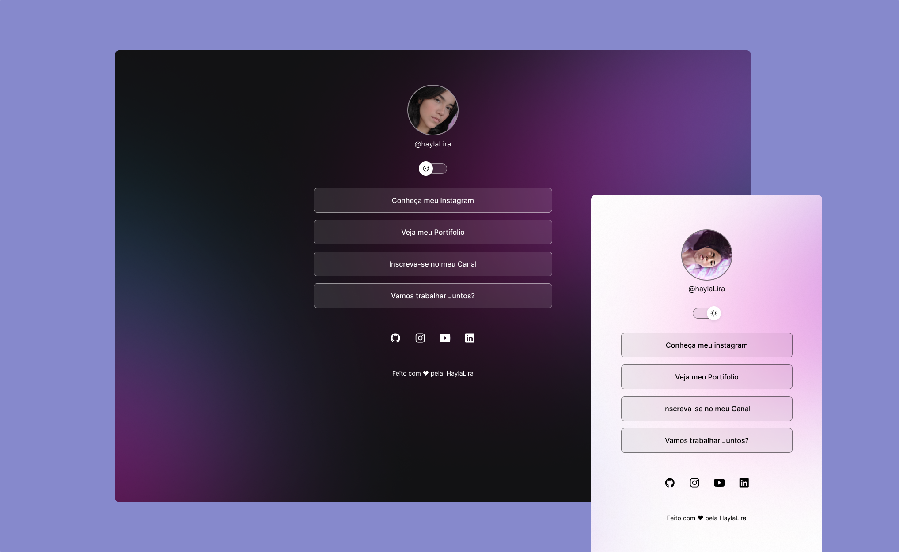

<h1 align="center"> CartãoDeVisitas</h1>

   Cartão super interativo e intuitivo para seus cliente, 
   que em único clique foram deslocados para melhor exposição das suas habilidades e serviços, 
   
     Ès Dev? faz gitClone e aproveita essa belezinha!

  <a href="#-tecnologias">Tecnologias</a>&nbsp;&nbsp;&nbsp;|&nbsp;&nbsp;&nbsp;
  <a href="#-projeto">Projeto</a>&nbsp;&nbsp;&nbsp;|&nbsp;&nbsp;&nbsp;
  <a href="#-layout">Layout</a>&nbsp;&nbsp;&nbsp;|&nbsp;&nbsp;&nbsp;
  <a href="#memo-licença">Licença</a>

 

  

## 🚀 Tecnologias

Esse projeto foi desenvolvido com as seguintes tecnologias:

- HTML e CSS
- JavaScript
- Git e Github

## 💻 Projeto

O Cartão de visitas é um projeto que mostra com facilidade modos e maneiras de entrarem em contato com você e descobrirem ainda mais sobre seus Serviços.
com apenas alguns links disponibilizamos uma visibilidade Geral, demonstrando profissionalimos e satisfação como experiencia do usuário.

## 🔖 Layout

Você pode visualizar o layout do projeto através [DESSE LINK](<https://www.figma.com/file/YwV0xc3MXKPXKVwscKZNjW/DevLinks-%E2%80%A2-Projeto-Discover-(Community)?type=design&node-id=0-1&t=A3OuGAjLTZ6v0L9b-0>) para acessá-lo.

## :memo: Licença

Esse projeto está sob a licença MIT.

---

Feito com ♥ by HaylaLira 